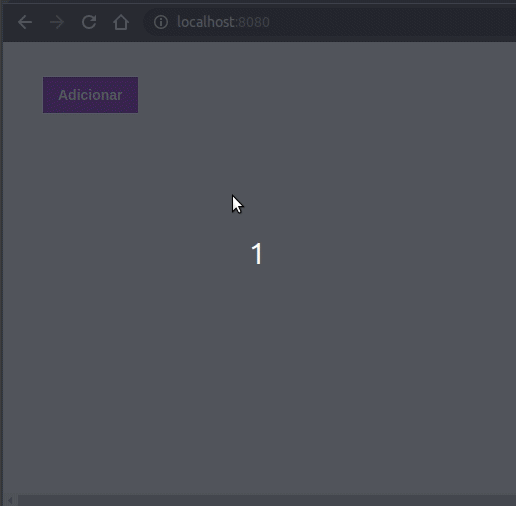

# Repository Like Web

A simple web interface to record a repository and delete it.

## App

## Why

That project is the second challenge from the course Go Stack from [Rocket Seat](https://github.com/Rocketseat). And I'm adding this project for my personal portifolio, so if you could let me any feedback I'd appreciate so much. Any comment that can make me a better programmer will be help a lot!

And for sure, you can use this Project as you wish!

It's free!

## Contact info

My [LinkedIn](https://www.linkedin.com/in/bruno8moura/)

My email bruno8moura@gmail.com

## Getting started

### Prerequisites

NodeJS version: ^12

## Running application

yarn dev

## Build with

- [@babel/core](https://www.npmjs.com/package/@babel/core) - It is the babel core.
- [@babel/preset-env](https://www.npmjs.com/package/@babel/preset-env) - A presets for environments(browsers). According to the major of browsers vendors, which resources from javascript can be used by babel in order to maintain the things working fine.
- [@babel/preset-react](https://www.npmjs.com/package/@babel/preset-react) - A presets for Babel understand the React plugin, e.g. jsx.
- [axios](https://www.npmjs.com/package/axios) - A lib ot make http requests. It is a good choice because we can patterned the url base for a especifi domain.
- [axios-mock-adapter](https://www.npmjs.com/package/axios-mock-adapter) - Axios adapter that allows to easily mock requests. Just for mock http requests.
- [babel-loader](https://www.npmjs.com/package/babel-loader) - Loader that enable webpack to transpile javascript files.
- [css-loader](https://www.npmjs.com/package/css-loader) - Loader that enable webpack to understand css files and put it into bundle.js
- [style-loader](https://www.npmjs.com/package/style-loader) - Loader that enable webpack to put the prior loaded css file within html file with the tag &lt;style&gt;.
- [file-loader](https://www.npmjs.com/package/file-loader) - Loader that enable webpack to work with files(e.g. images, txt, etc)
- [react](https://www.npmjs.com/package/react) - The core library for React.
- [react-dom]() - Enable React to communicate with HTML throught the DOM API.
- [react-scripts]() - Scripts and configurations used by 'create-react-app' app.
- [webpack](https://www.npmjs.com/package/webpack) - Bundle JavaScript files for usage in a browser.
- [webpack-cli](https://www.npmjs.com/package/webpack-cli) - Provides a flexible set of commands for developers throught the CLI.
- [@babel/plugin-transform-runtime](https://www.npmjs.com/package/@babel/plugin-transform-runtime) - In short, that plugin enable the use of async/await by babel tranpilation process throught the lib's dependency 'babel-runtime/regenerator'.
- [@testing-library/jest-dom](https://www.npmjs.com/package/@testing-library/jest-dom#tobeenabled) - Custom jest matchers to test the state of the DOM.
- [@testing-library/react](https://www.npmjs.com/package/@testing-library/react) - A lib for testing react components' state.
- [@testing-library/user-event](https://www.npmjs.com/package/@testing-library/user-event) - Fire events the same way the user does.
- [webpack-dev-server](https://www.npmjs.com/package/webpack-dev-server) - A webpack server for development that provides live reloading.

